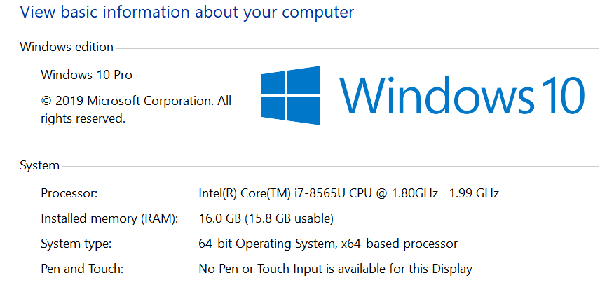
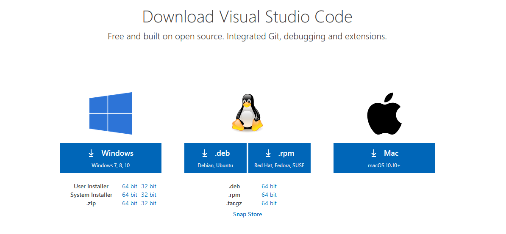

# Java Environment Setup Guide

## Purpose

> This document provides a list of the required technologies for the first week of training. While more technologies will be required in the later weeks, this document details why each technology is required and provides some step-by-step instructions on how to install and configure these technologies. This guide also walks you through any needed environment setup.

**NOTE**: It is VERY important that you install these technologies before training begins as we will not have much time to devote to environment setup due to the volume of content we'll cover. It is also important that you install the correct versions of the tools listed here as not all versions of the technologies we will use are guaranteed to be compatible with each other. If you choose to use a different version of one of the tools listed here, you will be responsible for debugging issues that are specific to your version.

## Required Technologies

The following technologies are required in order to complete this phase of the program:

- **Git**: We'll be using Git as a version control tool during the course of this program. Not only will you use Git to track changes to your projects, but you'll also use it to collaborate with your trainer and with your fellow associates.
- **Java SE Development Kit 8**: We will be utilizing Java 8 as our primary language for the duration of the program. This software development kit will provide the compiler and runtime environment needed to quickly and efficiently develop Java applications.
- **Eclipse**: We will be using Eclipse as our *integrated development environment* (IDE). Though you don't need an IDE to write code, an IDE provides several features that make rapid development (e.g. quickly writing and refactoring code) easier. 
**Note**: Feel free to use the IDE of your choice but you might be responsible for debugging issues that arise with that tool.
- **Apache Maven**: Maven is a software project management and build automation tool. We will use it to manage our projects' builds as it provides dependency management and streamlines several aspects of the testing life cycle.
- **Visual Studio Code (optional)**: Visual Studio Code is a text editor that makes viewing and modifying code simple. Do not confuse this tool with an integrated development environment as it does not come equipped with all of the development tools you typically find in an IDE. This tool is optional, but it can be helpful if you are new to programming and wish to familiarize yourself with the syntax of the Java programming language. 

## Installation Methods

There are two provided methods of attaining and configuring all of the necessary tools listed above:

1. Via a *package manager* or command-line installer - **Recommended**
2. Manually downloading the necessary software

Neither method is more "correct" than the other. You should choose the method of attaining the tools that works best for you. You may even choose to mix both methods, downloading some tools manually and others via a package manager.

**NOTE**: This guide primarily is written for those on a Windows Machine.

## Method 1: Installation Guide Using A Package Manager

A *package manager* is a command line tool that allows you to install and manage software. You can use a package manager to install all of the software listed here.

The package manager that we'll be using for this guide is called "Scoop". It's a command-line installer for Windows, which means that you'll have to be running Windows in order to use this tool. You'll also need PowerShell 5 (or a later version) installed.

**Note**: If you are not running Windows and still want to use a package manager, feel free to do so. You'll have to, however, know how to use your package manager of choice as there won't be instructions provided here since there are many package managers available. **If you do not wish to use a package manager, please skip to method 2.**

### Step 1: Install Scoop

In order to use Scoop, you'll first have to install it. This installation requires that you have PowerShell 5 or later.

Once you've verified that you have a compatible version of PowerShell, **launch PowerShell and run as administrator**. You can launch PowerShell by searching for it in the Windows search bar. Then, go to [Scoop's official website](https://scoop.sh/). Once on the homepage, scroll to the bottom of the page until you see the following:

As Scoop's installation instructions indicate, you can run one of the following commands in PowerShell (but NOT both of them):

Option 1:

    Invoke-Expression (New-Object System.Net.WebClient).DownloadString('https://get.scoop.sh')

Option 2:

    iwr -useb get.scoop.sh | iex

If you run one of these commands and it fails, you'll need to first run the following command:

    Set-ExecutionPolicy RemoteSigned -scope CurrentUser

After you've run this command, you should then attempt to run one of the first two commands again.

> If you are experiencing issues downloading Scoop, just use the Manual method which is outlined further down in this document.

### Step 2: Configure Scoop

When installed, Scoop comes with a default bucket titled "main". Since some of the programs we'll install using Scoop aren't contained in this bucket, we'll add some additional buckets before we begin installing our programs.

Open a new terminal and run the following commands (one by one):

    scoop bucket add extras
    scoop bucket add java
    scoop bucket add versions

**Note**: If you receive a warning that says that the bucket you're attempting to add already exists, you don't have to worry as this means that you already have that bucket.

### Step 3: Install Git

Now that you've installed Scoop and added some additional buckets for downloading software, open a new terminal and run the following command in order to install Git:

    scoop install git

After the installation is complete, verify that you have installed Git properly by typing the following in your terminal:

    git --version

### Step 4: Install Java

In order to install Java, run the following command in your terminal:

    scoop install lessmsi; scoop config MSIEXTRACT_USE_LESSMSI $true

Then run:

    scoop install ojdkbuild8-full

Java should have successfulls installed and scoop has configured your path variables. 
Now verify that you have installed Java properly by typing this command:

     java -version

### Step 5: Install Eclipse

In order to install Eclipse, run this command in your terminal:

    scoop install eclipse-jee@2020-12

Eclipse for Java JEE developers provides tools to optimize the development Java applications. 
**Note**: We will be the 2020-12 version due to some issues that sometime arise in most recent versions.   
If your installation was successful, you should now be able to search for "Eclipse IDE for Java EE Developers" in your Windows search bar.

### Step 6: Install Maven

In order to install Maven, run the following command in your terminal:

    scoop install maven

Verify that your Maven installation was successful by typing the following:

    mvn -version

### Step 7: Install Visual Studio Code (Optional)

In order to install Visual Studio Code, run the following command in your terminal:

    scoop install vscode

If the installation was successful, you should be able to search for "Visual Studio Code" in the Windows search bar.

## Method 2: Manual Installation

This method is compatible with all environments as it does not require any platform-specific package managers. You need only visit the official websites for each of the technologies listed and download the version of the tool that is compatible with your system.

Do note, however, that setting system environment variables differs from machine to machine. This guide shows how to set environment variables on a Windows machine.

The first thing you'll want to do is open your web browser of choice. This guide will use *Chrome*.

**Note**: Many of the tools that you will install have different system installers that are platform dependent. It is **very** important that you download the correct installer. The following list details how you should choose the installer for a program:

- If you have a 32-bit version of Windows, use the installer that is marked as the 32-bit version.
- If you have a 64-bit version of Windows, use the installer that is marked as the 64-bit version.
- If you have a Linux distribution (e.g. Debian, Ubuntu, Red Hat, Fedora), you should choose the installer that matches your distribution.
- If you have a Mac, you should choose the installer that is marked as the Mac installer.

These options will be clearly labeled on the websites you visit to download the technologies. If you're not sure how to figure out what version of the Windows operating system you're running, do the following:

1. Type "Control Panel" into the Windows search bar and click on the "Control Panel" app.
2. Select "System and Security".
3. Select "System".

You should now see the following screen:

You should see your operating system listed ("Windows 10" in the above example) and the system type listed under the "System" tab (a 64-bit operating system in the above example).

### Step 1: Install Git

1. Navigate in your browser to [Git's Website](https://git-scm.com/download) and click the **latest** download for Windows. (For those using a different OS click the appropriate OS and look for the most recent stable release.)

 

2. Click yes to any security/firewall popup asking if you are sure you want to download the file. 

3. The install file will begin downloading; most browsers will show the file that has just downloaded, click that file when it completes. If you do so skip to step 6. If the download is not apparent on your browser or disappears upon finishing go to step 4. 

4. If you were not able to click the install exe file you just downloaded in your browser open your file explorer.

5. In the window that opens click the "Downloads" folder, use the search bar in the upper right to search "git", and then double click on the Git installer exe file.

6. Click yes to any security pop-ups asking you if you want to allow the installer to make changes to your computer. 

7. The install wizard will open to guide you through the process of installing Git. Read the license agreement and click "Next." 

8. Accept the default installation path by clicking "Next."

9. Select your components. It is recommended to add a desktop icon. Leave the other boxes in their default setting. Click "Next."

10. Leave the rest of the set up as the default configuration clicking Next until you get to the experimental options (which you should leave unchecked) and then click Install. This will run the actual install process. 

11. After install you will get a a final window giving you the options to launch Git Bash and view the Readme notes. Select open Git Bash and deselect the view Readme notes. Click "Next."

12. When Git Bash opens type "git --version" and hit Enter. If it return the version of Git you installed it correctly. 

### Step 2: Install Java

1. Navigate in your web browser to [Oracle's JDK 8](https://www.oracle.com/java/technologies/javase/javase-jdk8-downloads.html?) website. NOTE: If you are experiencing errors when trying to load the webpage try another browser. If you still are having trouble, try again later. 

2. In the top right of the website click "View Accounts" and then "Create an Account." (If you already have an Oracle account you can just skip to step 5)

3. Fill in the form with your information (you may type "none" for Company Name) and then click the "Create Account" button. 

4. Check your e-mail account for a new message from Oracle. (This may take a few minutes.) When you receive the e-mail open it and click the "Verify Email Address" button inside. This should direct you to a success screen. 

5. Return to [Oracle's JDK 8](https://www.oracle.com/java/technologies/javase/javase-jdk8-downloads.html?) website. Scroll to find the appropriate JDK for your Operating System and Architecture. (Windows 10 will be Windows x64 as shown below) and click to download. 

6. A popup will ask you to review the license before continuing. Do so and click the check box and then the download button.

7. If you are not signed in a pop will appear asking you to do so. Enter your sign in information (your e-mail is your user name) and submit. The download should then begin. 

8. Once the download is complete, click the file that downloads in your browser to open it and skip to step 11. If you do not see the file in your browser then proceed to step 9 to find it in your downloads folder. 

9. If you could not open the JDK installer from your browser open your file explorer. 

10. In the window that opens click the "Downloads" folder, search (in the top right) for "jdk" and double click the jdk installer.

11. The installer will inform you that the license has been updated from previous versions. Review the license if you have not already and click next. 

12. The installer will continue and you should just accept the default setup. IMPORTANT: Make note of the file path for the installation directory! You WILL need this later. Click "Next."

13. The install will begin extracting files and will ask to confirm the installation directory of the JRE. Confirm the default directory by clicking "Next."

14. Java will finish installing and you can then click "Close."

15. Use your system search tool (next to the windows button) to look for "Edit the system environment variables" in the control panel. Be sure that you open the SYSTEM environment not the ones just for your account. 

16. Click the "Environment Variables" button in the window that opens.

17. Under "System Variables" click the "New" button. 

18. Name the new variable "JAVA_HOME" and give it the value of the directory where your JDK was installed to. (See Step 12.) If you are unsure of your directory path you can go to C:\Program Files\Java in your file explorer then click on the JDK folder to open it. You can then copy the path from the navigation bar at the top of the file explorer. 

19. In your system variables then select the "Path" variable and click "Edit."

20. Click "New" to create a new line. Add the path to the JDK bin folder in this line, it will be the same as the path in JAVA_HOME with a "\bin" at the end. 

21. Click "OK" to close the Environment Variables window. 

22. Open Git Bash, type "java -version" and hit Enter. If the JDK is installed correctly you should see Java with the version number you downloaded. 

### Step 3: Install Eclipse

Navigate to the [Eclipse](https://www.eclipse.org/downloads/packages/release/2020-12/r/eclipse-ide-enterprise-java-developers) website and download the 2020-12 version for Eclipse IDE for Enterprise Java Developers. 

**Note**: More recent versions of Eclipse JEE have some issues so we will be using the 2020-12 version. 

### Step 4: Install Apache Maven

1. Navigate in your web browser to the [Maven Download Page](https://maven.apache.org/download.cgi) and scroll down to the "Files" section. Click the Binary zip archive link to download. Approve any firewall/security popups asking if you are sure you want to download the file. 

2. The download should appear in your browser. When it completes right-click and click "Show in folder." Skip to step 4. If you were unable to right-click and show in folder proceed to step 3. 

3. If you could not open the file location from your browser, open your file explorer, click downloads, and search "maven" in the upper right search bar. You should see the file you just downloaded. 

4. Right click the Maven zip archive you just downloaded and click "Extract All..."

5. Your extraction wizard will open. Set the file path to "C:\Maven" and click the box to show extracted files when complete. Then click "Extract."

6. Your file will be unzipped and your file explore will open a window to C:\Maven containing the folder with your maven version. Double click to open that folder. 

7. Now inside the versions specific folder, click the navigation bar and the top and copy the file path. You will need this for your environment variables. 

8. Use your system search tool (next to the windows button) to look for "Edit the system environment variables" in the control panel. Be sure that you open the SYSTEM environment not the ones just for your account. 

9. Click the "Environment Variables" button in the window that opens.

10. Under "System Variables" click the "New" button. 

11. Name the new variable "M2_HOME" and give it the value of the file path you copied in step 7. Then click "OK."

12. Click the new button again. Give the variable the name "M2" and the file path "%M2_HOME%\bin" then click "OK."

13. In your system variables then select the "Path" variable and click "Edit."

14. Click new to open a new line and type in "%M2%" then click "OK."

15. Click "OK" to close the Environment Variables window. 

16. Open Git Bash and type "mvn -v" then hit Enter. If that returns the maven version you have it set up correctly. 

### Step 5: Install Visual Studio Code (Optional)

In order to download Visual Studio Code, please visit [Visual Studio Code's official website](https://code.visualstudio.com/download).

Once you've navigated to the website, you should see the following:

Choose the installer that is compatible with your system. Once you've clicked the installer of your choice, you'll be prompted to save the file. Do so.

Once you've saved the installer, it should be located in your "Downloads" folder.

Double click the installer. Once you've done so, the installer should be launched. Accept the license agreement and proceed until you reach a menu titled "Select Additional Tasks". Once you've arrived here, be sure to check all of the boxes that are checked in the image!

After you've done so, hit "Next" and then "Install" on the next menu. If your installation was successful, you should be able to search for "Visual Studio Code" on your machine.

Additional Resources
====================

*  **Git Cheat Sheet** (This is a GitHub-provided cheat sheet for some simple Git commands.): https://github.github.com/training-kit/downloads/github-git-cheat-sheet.pdf
*  **Java Docs** (The official API specification for Java 8): https://docs.oracle.com/javase/8/docs/api/
*  **Maven Repository** (This provides a repository of dependencies which we can add to our Project Object Models.): https://mvnrepository.com/

